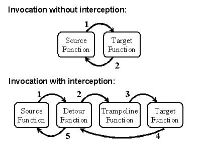
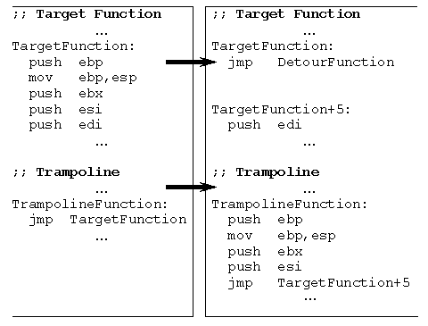

# Interception of Binary Functions
Detours ライブラリは、関数呼び出しのインターセプトを可能にします。傍受コードは実行時に動的に適用されます。Detours は、ターゲット関数の最初の数個の命令を、ユーザーが提供する detour 関数への無条件ジャンプに置き換えます。ターゲット関数からの命令はトランポリン関数に保存されます。トランポリンは、ターゲット関数から削除された命令と、ターゲット関数の残りの部分への無条件分岐で構成されます。

実行がターゲット関数に到達すると、制御はユーザが用意したdetour関数に直接ジャンプします。detour関数は、適切なインターセプト前処理を実行します。detour 関数は、制御をソース関数に戻すか、トランポリン関数を呼び出すことができます。ターゲット関数が完了すると、制御を detour 関数に返します。detour関数は適切な後処理を行い、制御をソース関数に返す。図 1 に、インターセプトがある場合とない場合の関数呼び出しの制御の論理的な流れを示します。

図1. Detoursを使わない場合とDetoursを使う場合の呼び出しの制御フロー

Detours ライブラリは、ターゲット関数のインプロセスバイナリイメージを書き換えることで、ターゲット関数をインターセプトします。各ターゲット関数に対して、Detours は実際にターゲット関数と一致するトランポリン関数の 2 つの関数と、ターゲットポインタである 1 つの関数ポインタを書き換えます。トランポリン関数は Detours によって動的に割り当てられます。迂回路の挿入前には、トランポリンにはターゲット関数へのジャンプ命令が1つだけ含まれています。挿入後、トランポリンはターゲット関数からの初期命令と、ターゲット関数の残りの部分へのジャンプ命令を含みます。

ターゲットポインタは、ターゲット関数を指すようにユーザによって初期化される。迂回路がターゲット関数に取り付けられた後、ターゲットポインタはトランポリン関数を指すように修正される。迂回路がターゲット関数から切り離されると、ターゲットポインタは元のターゲット関数を指すように戻されます。

図2. トランポリン関数とターゲット関数、迂回路の挿入前（左）と挿入後（右）。

図2は、迂回路の挿入を示しています。ターゲット関数を迂回させるために、Detours はまず動的トランポリン関数用のメモリを確保し（スタティックトランポリンがない場合）、ターゲットとトランポリンの両方への書き込みアクセスを可能にします。Detours は最初の命令から始めて、少なくとも 5 バイト (無条件にジャンプ命令を実行するのに十分な量) がコピーされるまで、ターゲットからトランポリンへ命令をコピーします。ターゲット関数が 5 バイト未満の場合、Detours は中止してエラーコードを返します。

命令をコピーするには、Detours は単純なテーブル駆動の逆アセンブラを使用します。Detours は、ターゲット関数の最初のコピーされていない命令にトランポリンの端からジャンプ命令を追加します。Detours は、ターゲット関数の最初の命令として detour 関数に無条件でジャンプ命令を書き込みます。最後に、Detours はターゲット関数とトランポリン関数の両方で元のページパーミッションを復元し、FlushInstructionCache API を呼び出して CPU 命令キャッシュをフラッシュします。

www.DeepL.com/Translator（無料版）で翻訳しました。